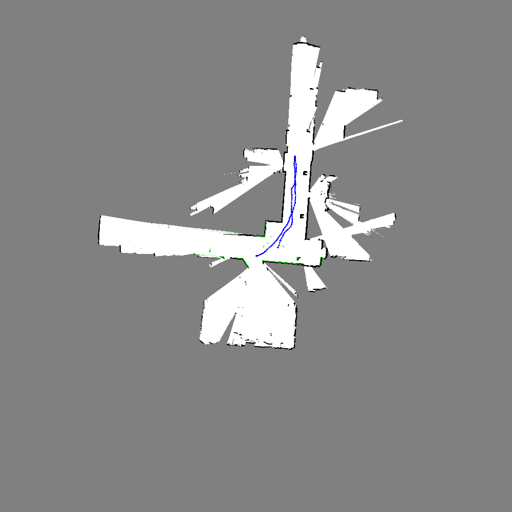
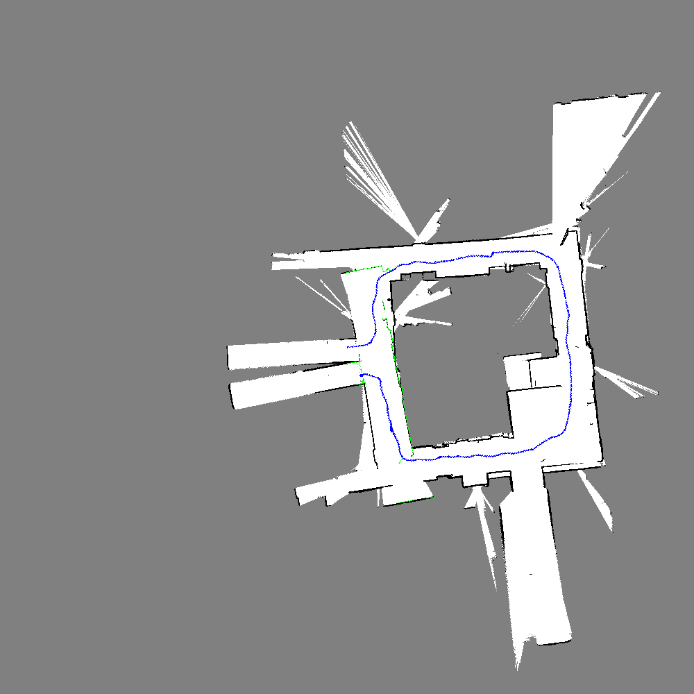

# Upenn ESE650 Learning in Robotics, Project 4  
1. Put lidar and joint data .m file into folder .\train\data  
2. Modify data_idx and dir in SLAM.py  
3. Run SLAM.py, the tunning on map and particles can be done in init_SLAM()  
4. a sequence of map plot will be shown, the last plot will be saved  
   occupied grid is in black, free grid is in white, undetermined is in gray, robot trajectory in blue and lidar scan of the best particle in green

